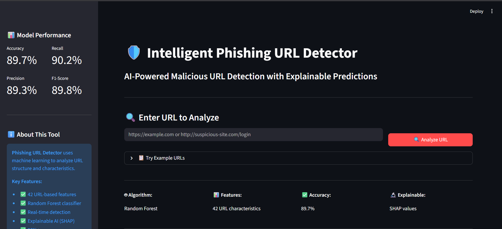
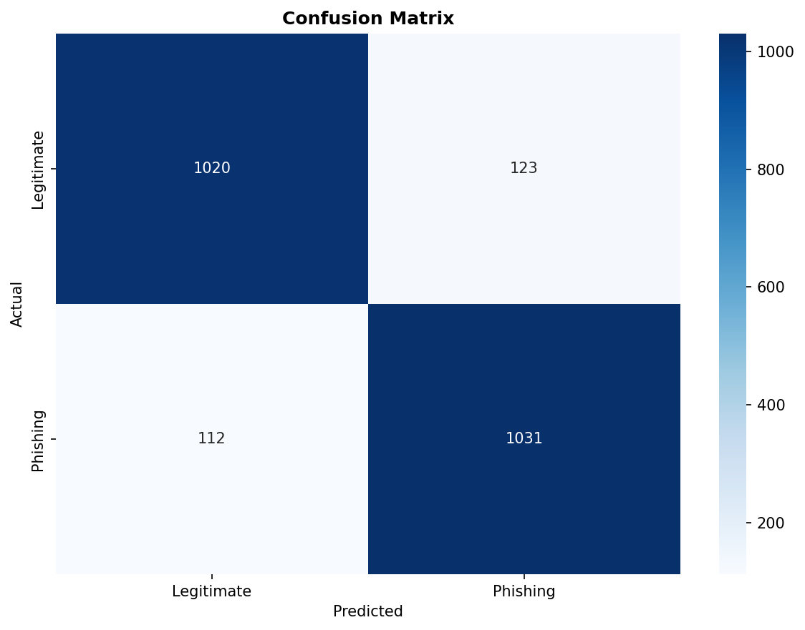
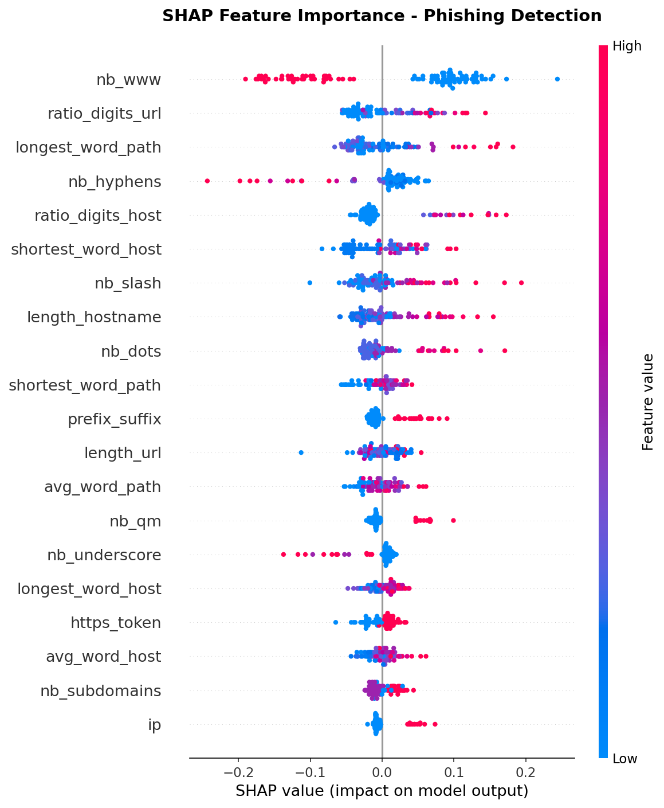
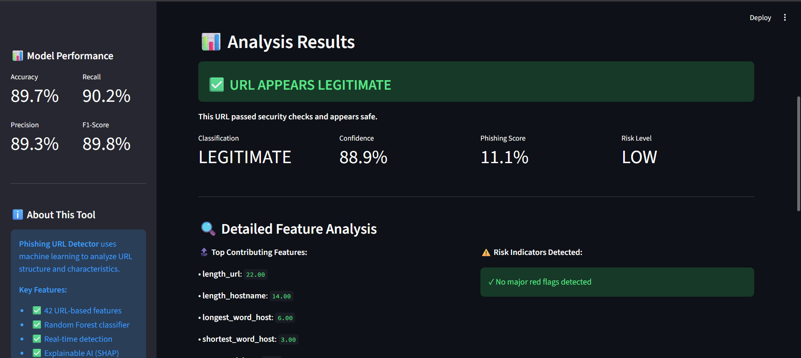

# 🛡️ Intelligent Phishing URL Detector


AI-powered phishing URL detection using Machine Learning and Explainable AI (SHAP).



## 🎯 Problem Statement

Phishing attacks cost billions annually and compromise millions of users. Traditional blacklist-based approaches are reactive and easily bypassed. This project uses machine learning to proactively identify phishing URLs based on structural patterns and characteristics.

## ✨ Key Features

- **42 URL-based Features**: Comprehensive structural analysis
- **Random Forest Classifier**: 89.7% accuracy, 90.2% recall
- **Real-time Detection**: Instant analysis with no external APIs
- **Explainable AI**: SHAP values show exactly why each prediction was made
- **Privacy-Focused**: All analysis done locally, no data stored
- **User-Friendly Interface**: Clean Streamlit web application


## 📊 Performance Metrics

| Metric | Score | Industry Standard |
|--------|-------|-------------------|
| Accuracy | **89.72%** | >85% ✅ |
| Precision | **89.34%** | >85% ✅ |
| Recall | **90.20%** | >85% ✅ |
| F1-Score | **89.77%** | >85% ✅ |
| ROC-AUC | **96.31%** | >90% ✅ |

## 🚀 Quick Start

### Prerequisites
- Python 3.8+
- pip

### Installation
```bash
# Clone repository
git clone <your-repo-url>
cd phishing-url-detector

# Create virtual environment
python -m venv env
source env/bin/activate  # On Windows: env\Scripts\activate

# Install dependencies
pip install -r requirements.txt
```

### Running the Application
```bash
# Launch web app
cd src
streamlit run app.py
```

App will open at `http://localhost:8501`

## 📁 Project Structure
```
phishing-url-detector/
├── data/raw/                  # Dataset (11,430 URLs)
├── models/                    # Trained models & visualizations
│   ├── phishing_detector_model.pkl
│   ├── shap_*.png            # 8 explainability plots
│   └── *.png                 # Performance visualizations
├── notebooks/                 # Analysis notebooks
│   ├── 01_eda.ipynb
│   └── 02_shap_explainability.ipynb
├── src/                       # Source code
│   ├── app.py                # Streamlit web app ⭐
│   ├── feature_extraction.py # Feature engineering
│   ├── train_model.py        # Training pipeline
│   └── utils.py
├── requirements.txt
└── README.md
```
## 🔬 Technical Approach

### Dataset
- **11,430 URLs** (perfectly balanced)
- Source: Kaggle phishing URL dataset
- 50% phishing, 50% legitimate


## 🔬 Methodology

### 1. Dataset
- **Source**: Kaggle phishing URL dataset
- **Size**: 11,430 URLs (perfectly balanced: 50% phishing, 50% legitimate)
- **Features**: 88 pre-extracted features

### 2. Feature Engineering
Selected 42 URL-extractable features that can be computed in real-time without external APIs:
- URL length, hostname length
- Character counts (dots, hyphens, special chars)
- Domain characteristics (IP address, subdomains, TLD)
- Suspicious patterns (shortening services, HTTPS in path)
- Statistical measures (digit ratios, entropy)

### 3. Model Selection
- **Algorithm**: Random Forest (200 trees, max_depth=25)
- **Rationale**:
  - Handles non-linear relationships
  - Built-in feature importance
  - Robust to outliers
  - No feature scaling needed
  - Interpretable

### 4. Explainability
- **SHAP (SHapley Additive exPlanations)**: Shows contribution of each feature to individual predictions
- Visualizations: Summary plots, waterfall plots, dependence plots

### 5. Deployment
- **Framework**: Streamlit
- **Features**: Real-time analysis, interactive UI, downloadable results

## 📈 Results & Analysis

### Confusion Matrix


### Feature Importance
Top 10 most important features:
1. `length_url` - URL length
2. `nb_dots` - Number of dots
3. `ratio_digits_url` - Proportion of digits
4. `nb_subdomains` - Subdomain count
5. `https_token` - 'https' in path
... (see full analysis in notebooks)

### SHAP Explainability


## 🎓 Educational Value

This project demonstrates:
- **End-to-end ML pipeline**: Data → Features → Training → Deployment
- **Feature engineering**: Domain-specific knowledge applied to ML
- **Model selection**: Choosing appropriate algorithms
- **Explainable AI**: Making black-box models interpretable
- **Production deployment**: Real-world web application

## 🚧 Limitations & Future Work

### Current Limitations
- No real-time domain age/WHOIS lookup (would require API)
- No content analysis (HTML, JavaScript)
- No SSL certificate validation
- Limited to structural features only

### Future Enhancements
- [ ] Add domain reputation APIs (VirusTotal, Google Safe Browsing)
- [ ] Implement WHOIS lookups for domain age
- [ ] Build Chrome extension for real-time protection
- [ ] Add URL screenshot capture
- [ ] Implement batch URL analysis
- [ ] Deploy to cloud (Streamlit Cloud, Heroku)

## 🛠️ Technologies Used

- **Python 3.11**
- **scikit-learn**: Random Forest classifier
- **Streamlit**: Web application framework
- **SHAP**: Explainability library
- **Pandas/NumPy**: Data manipulation
- **Matplotlib/Seaborn**: Visualizations
- **tldextract**: URL parsing

## 📸 Screenshots

### Main Interface


### Phishing Detection


### Legitimate URL


## 🤝 Contributing

This is an educational project. Suggestions and improvements are welcome!

## 📄 License

MIT License - Feel free to use for educational purposes.

## 👨‍💻 Author

Built as part of AI/ML coursework - January 2026

## 🙏 Acknowledgments

- Dataset: Kaggle Phishing URL Dataset
- Inspiration: Real-world cybersecurity challenges
- Course: AI/ML subject curriculum

---

**⚠️ Disclaimer**: This tool is for educational purposes. While it achieves 90% accuracy, it should not be used as the sole protection against phishing. Always practice safe browsing habits and use comprehensive security solutions.
